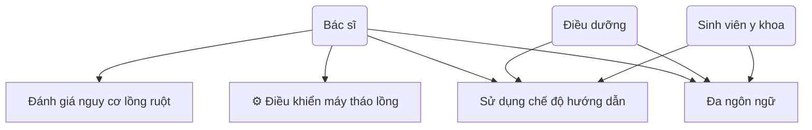
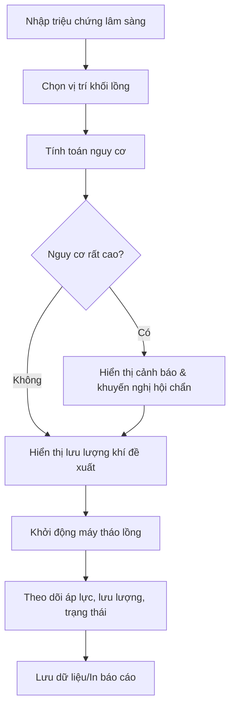

 MÔ TẢ HỆ THỐNG SMART AIR MACHINE

 Tổng quan hệ thống

Smart Air Machine là một hệ thống thông minh hỗ trợ điều trị lồng ruột (Intussusception) bằng phương pháp tháo lồng bằng khí. Đây là một ứng dụng web được phát triển bằng React và Vite, cung cấp giao diện người dùng thân thiện cho các chuyên gia y tế.

 Mục đích và ứng dụng

Hệ thống được thiết kế để:
- Hỗ trợ bác sĩ đánh giá nguy cơ trước khi thực hiện tháo lồng ruột
- Tính toán lưu lượng khí phù hợp dựa trên triệu chứng lâm sàng
- Cung cấp giao diện điều khiển máy tháo lồng ruột
- Theo dõi và giám sát quá trình điều trị

 Các chức năng chính

 1. Đánh giá triệu chứng lâm sàng
Hệ thống cho phép bác sĩ chọn các triệu chứng quan sát được ở bệnh nhân:
- Thời gian lồng ≥ 24h (2 điểm)
- Nôn mật hoặc nôn kéo dài (2 điểm)
- Bí trung đại tiện (2 điểm)
- Bụng trướng rõ (2 điểm)
- Sốt > 38°C (2 điểm)
- XQ bụng có mức nước-hơi (2 điểm)

 2. Xác định vị trí khối lồng
Bác sĩ có thể chọn vị trí khối lồng ruột trên siêu âm:
- Bên phải rốn (1 điểm)
- Trên rốn (2 điểm)
- Bên trái rốn (3 điểm)
- Không thấy (1 điểm)

 3. Tính toán nguy cơ và khuyến nghị
Hệ thống tự động tính toán điểm nguy cơ và phân loại:
- Nguy cơ thấp (≤2 điểm): Lưu lượng khuyến nghị 0.5 LPM
- Nguy cơ trung bình (3-5 điểm): Lưu lượng khuyến nghị 0.4 LPM
- Nguy cơ cao (6-8 điểm): Lưu lượng khuyến nghị 0.3 LPM
- Nguy cơ rất cao (≥9 điểm): Lưu lượng khuyến nghị 0.2 LPM

 4. Điều khiển máy
- Khởi động máy tháo lồng ruột
- Theo dõi áp lực và lưu lượng khí
- Hiển thị trạng thái hệ thống

 5. Chế độ hướng dẫn
- Hướng dẫn từng bước cho người dùng mới
- Hiển thị tiến trình thao tác
- Cung cấp thông tin hỗ trợ

 6. Đa ngôn ngữ
- Hỗ trợ tiếng Việt và tiếng Anh
- Chuyển đổi ngôn ngữ dễ dàng

 Công nghệ sử dụng

 Frontend Framework
- React 19.1.0: Framework JavaScript chính
- Vite 6.3.5: Build tool và development server
- Tailwind CSS 4.1.7: Framework CSS utility-first

 UI Components
- Radix UI: Thư viện component accessible
- Lucide React: Icon library
- Framer Motion: Animation library
- Recharts: Thư viện biểu đồ

 Các thư viện hỗ trợ
- React Hook Form: Quản lý form
- Zod: Validation schema
- React Router DOM: Routing
- Sonner: Toast notifications

 Cấu trúc dự án

```
smart-air-machine-ui/
├── src/
│   ├── components/ui/      UI components (Radix UI)
│   ├── hooks/             Custom React hooks
│   ├── lib/               Utility functions
│   ├── App.jsx            Component chính
│   └── main.jsx           Entry point
├── public/                Static assets
├── package.json           Dependencies
└── vite.config.js         Vite configuration
```

 Giao diện người dùng

 Layout chính
- Header: Logo, tên hệ thống, chuyển đổi ngôn ngữ
- Left Column: Form nhập liệu triệu chứng và vị trí
- Right Column: Kết quả đánh giá và điều khiển máy
- Footer: Thông tin phiên bản và lưu ý

 Responsive Design
- Hỗ trợ desktop và mobile
- Grid layout linh hoạt
- Giao diện thân thiện với touch

 Tính năng bảo mật và an toàn

- Cảnh báo nguy cơ cao: Hiển thị cảnh báo khi điểm nguy cơ ≥9
- Validation: Kiểm tra dữ liệu đầu vào
- Disabled states: Vô hiệu hóa nút khi chưa đủ dữ liệu
- Clinical protocols: Tuân thủ quy trình y tế

 Hướng dẫn sử dụng

 Bước 1: Nhập triệu chứng
Chọn các triệu chứng lâm sàng quan sát được ở bệnh nhân

 Bước 2: Chọn vị trí
Xác định vị trí khối lồng ruột trên siêu âm

 Bước 3: Tính toán
Nhấn nút "Tính toán nguy cơ" để nhận kết quả đánh giá

 Bước 4: Điều khiển máy
Khởi động máy với lưu lượng khuyến nghị và theo dõi quá trình

 Lưu ý quan trọng

- Hệ thống chỉ hỗ trợ quyết định lâm sàng, không thay thế chuyên môn y tế
- Luôn tuân thủ protocol điều trị của bệnh viện
- Cần hội chẩn ngoại khoa khi nguy cơ rất cao
- Theo dõi sát bệnh nhân trong quá trình điều trị

 Phiên bản và cập nhật

- Phiên bản hiện tại: v1.0
- Ngày phát hành: 2025
- Nhà phát triển: 
- Mục đích: Sử dụng trong môi trường y tế chuyên nghiệp

 Use Cases (Tình huống sử dụng)

 Use Case 1: Đánh giá nguy cơ lồng ruột
Mô tả: Đây là chức năng cốt lõi của hệ thống, cho phép bác sĩ đánh giá mức độ nguy hiểm của bệnh lồng ruột dựa trên các triệu chứng lâm sàng và vị trí khối lồng được phát hiện trên siêu âm.

Tác nhân chính: Bác sĩ chuyên khoa nhi hoặc bác sĩ cấp cứu

Điều kiện tiên quyết: Bệnh nhân đã được chẩn đoán lồng ruột qua siêu âm

Luồng sự kiện chính:
1. Bác sĩ mở hệ thống Smart Air Machine
2. Chọn các triệu chứng lâm sàng quan sát được ở bệnh nhân từ danh sách có sẵn
3. Xác định vị trí khối lồng ruột trên siêu âm
4. Nhấn nút "Tính toán nguy cơ"
5. Hệ thống hiển thị điểm nguy cơ và phân loại mức độ nguy hiểm
6. Hệ thống đưa ra khuyến nghị lưu lượng khí phù hợp

Luồng sự kiện thay thế:
- Nếu điểm nguy cơ ≥ 9: Hệ thống hiển thị cảnh báo đỏ và khuyến nghị hội chẩn ngoại khoa

Kết quả: Bác sĩ có được đánh giá nguy cơ chính xác và lưu lượng khí đề xuất để điều trị

 Use Case 2: Điều khiển máy tháo lồng
Mô tả: Sau khi đánh giá nguy cơ, bác sĩ sử dụng hệ thống để khởi động và giám sát máy tháo lồng ruột với các thông số đã được tính toán.

Tác nhân chính: Bác sĩ điều trị

Điều kiện tiên quyết: Đã hoàn thành đánh giá nguy cơ và có lưu lượng khí đề xuất

Luồng sự kiện chính:
1. Bác sĩ xem lại kết quả đánh giá nguy cơ
2. Kiểm tra các thông số lưu lượng khí đề xuất
3. Nhấn nút "Khởi động máy"
4. Hệ thống bắt đầu quá trình tháo lồng với lưu lượng khí đã thiết lập
5. Theo dõi thời gian thực các thông số: áp lực, lưu lượng, trạng thái hệ thống
6. Quan sát phản ứng của bệnh nhân trong quá trình điều trị

Luồng sự kiện thay thế:
- Nếu có dấu hiệu bất thường: Dừng máy ngay lập tức
- Nếu cần điều chỉnh: Thay đổi lưu lượng khí theo tình huống

Kết quả: Máy tháo lồng hoạt động an toàn và hiệu quả theo đúng protocol

 Use Case 3: Sử dụng chế độ hướng dẫn
Mô tả: Hệ thống cung cấp chế độ hướng dẫn từng bước cho người dùng mới hoặc ít kinh nghiệm, đảm bảo thao tác an toàn và đúng quy trình.

Tác nhân chính: Bác sĩ mới, điều dưỡng, sinh viên y khoa

Điều kiện tiên quyết: Người dùng chưa quen thuộc với hệ thống

Luồng sự kiện chính:
1. Người dùng bật chế độ hướng dẫn bằng checkbox
2. Hệ thống hiển thị thanh tiến trình và hướng dẫn từng bước
3. Người dùng làm theo hướng dẫn hiển thị trên màn hình
4. Hệ thống kiểm tra và xác nhận từng bước hoàn thành
5. Tiếp tục đến bước tiếp theo cho đến khi hoàn thành

Luồng sự kiện thay thế:
- Nếu người dùng muốn bỏ qua: Có thể tắt chế độ hướng dẫn bất cứ lúc nào
- Nếu có lỗi: Hệ thống hiển thị thông báo lỗi và hướng dẫn khắc phục

Kết quả: Người dùng mới có thể sử dụng hệ thống một cách an toàn và hiệu quả

 Use Case 4: Đa ngôn ngữ
Mô tả: Hệ thống hỗ trợ chuyển đổi giao diện giữa tiếng Việt và tiếng Anh, phù hợp với môi trường y tế quốc tế và đa dạng người dùng.

Tác nhân chính: Tất cả người dùng hệ thống

Điều kiện tiên quyết: Không có

Luồng sự kiện chính:
1. Người dùng nhấn nút chọn ngôn ngữ trên giao diện
2. Hệ thống chuyển đổi toàn bộ giao diện sang ngôn ngữ được chọn
3. Tất cả text, label, button đều được hiển thị bằng ngôn ngữ mới
4. Các thông số kỹ thuật vẫn giữ nguyên định dạng chuẩn

Luồng sự kiện thay thế:
- Người dùng có thể chuyển đổi ngôn ngữ bất cứ lúc nào trong quá trình sử dụng
- Cài đặt ngôn ngữ được lưu lại cho lần sử dụng tiếp theo

Kết quả: Giao diện hiển thị bằng ngôn ngữ người dùng mong muốn

---

 Sơ đồ Use Case (Use Case Diagram)



---

 Sơ đồ luồng hoạt động tổng quát (Flow Diagram)



--- 
